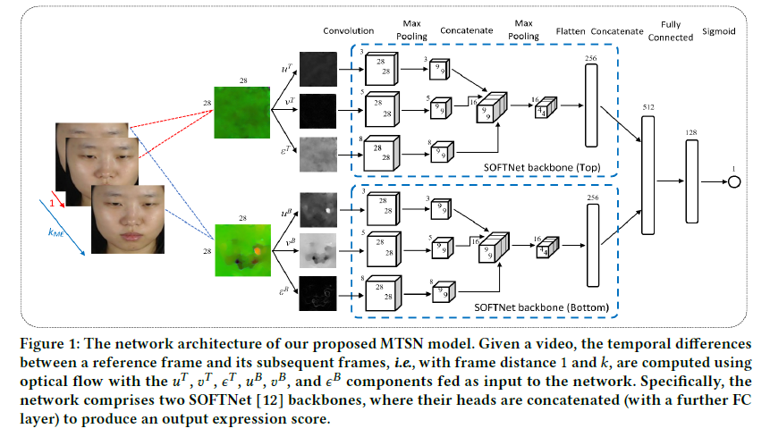
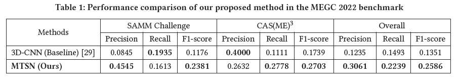
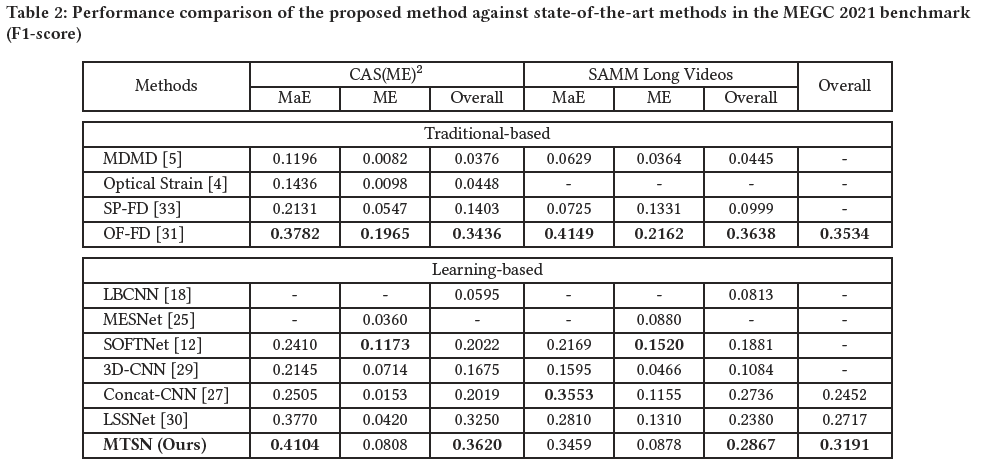

# MTSN-Spot-ME-MaE

This is the code repository for the FME 2022 accepted paper: <br> 
<b>MTSN: A Multi-Temporal Stream Network for Spotting Facial Macro- and Micro-Expression with Hard and Soft Pseudo-labels</b>.

## Network


## Results



## Test on MEGC 2022 unseen datasets

<b>Step 1)</b> Installation of packages using pip

``` pip install -r requirements.txt ```

<b>Step 2)</b> Download processed optical flow features from :

<!--
<b>The link is hidden at the moment but will be made available soon. </b>
-->
https://drive.google.com/file/d/1Cn4rux-Hwrt6E1LWO3VL3ddNqOwmgP71/view?usp=sharing
  
<b>Step 3)</b> Place the folder (megc2022-processed-data) accordingly: <br>
>├─megc2022-pretrained-weights <br>
>├─megc2021-ground-truth <br>
>├─<b>megc2022-processed-data</b> <br>
>├─...... <br>
>├─test_main.py <br>
>└─......

<b>Step 4)</b> Evaluation for MEGC 2022 unseen datasets CAS(ME)<sup>3</sup> and SAMM Challenge

``` python test_main.py ```
  
## Train on MEGC 2021 datasets

<b>Step 1)</b> Installation of packages using pip

``` pip install -r requirements.txt ```

<b>Step 2)</b> Download processed optical flow features from :

<!--
<b>The link is hidden at the moment but will be made available soon. </b>
https://drive.google.com/file/d/1mE9TQ50J6Iq4vN0-59fU-2aKNulTf2L2/view?usp=sharing -> Last uploaded link
-->
https://drive.google.com/file/d/1UVnJtZoCZK5nmMbt1zhIhYkJYPW3Tc6o/view?usp=sharing

  
<b>Step 3)</b> Place the folder (megc2021-processed-data) accordingly: <br>
>├─megc2022-pretrained-weights <br>
>├─megc2021-ground-truth <br>
>├─<b>megc2021-processed-data</b> <br>
>├─...... <br>
>├─train_main.py <br>
>└─......

<b>Step 4)</b> Train on MEGC 2021 dataset CAS(ME)<sup>2</sup> and SAMM Long Videos

``` python train_main.py --dataset_name CASME_sq```

#### Note for parameter settings <br>
&nbsp; --dataset_name (CASME_sq or SAMMLV) <br>
  
## Additional Notes
  
If you have issue installing torch, run this: <br>
``` pip install torch===1.5.0 torchvision===0.6.0 torchsummary==1.5.1 -f https://download.pytorch.org/whl/torch_stable.html ```
  
## Link to research paper

If you find this work useful, please cite the paper:
https://dl.acm.org/doi/abs/10.1145/3552465.3555040

@inproceedings{liong2022mtsn, <br>
  title={MTSN: A Multi-Temporal Stream Network for Spotting Facial Macro-and Micro-Expression with Hard and Soft Pseudo-labels}, <br>
  author={Liong, Gen Bing and Liong, Sze-Teng and See, John and Chan, Chee-Seng}, <br>
  booktitle={Proceedings of the 2nd Workshop on Facial Micro-Expression: Advanced Techniques for Multi-Modal Facial Expression Analysis}, <br>
  pages={3--10}, <br>
  year={2022} <br>
} <br>

##### Please email me at genbing67@gmail.com if you have any inquiries or issues.
